**A module to create random and almost certainly unique artworks!**

After seeing dozens of artificial intelligence projects to create artworks, I thought it would be cool to try something different. Instead of using a learning model, I wanted to develop something that could create artworks without any previous experience. This module is the result that I managed to achieve in a few days, mainly playing with Pillow libary and using concepts of probability and geometry.

Anyway, I liked the end result so I thought it was worth working on a detailed docstring and making the code available, in case anyone else finds it interesting

# Generating Images From Predefined Functions

**The easiest way to use this module is by calling the function create_geometric_art() or the function create_chaotic_art()**

**Both functions will return an image with a completely random artwork (each with a specific style). Take a look:**


```python
from ArtGenerator import create_geometric_art

# Generating five random artworks with "geometric style"
for i in range(5):
    im = create_geometric_art()
    display(im)
```


    
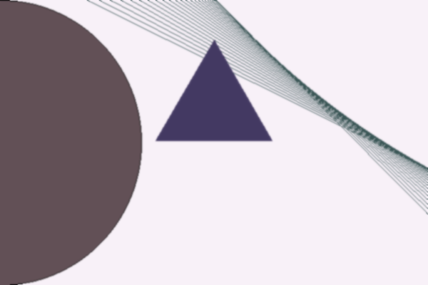
    


    
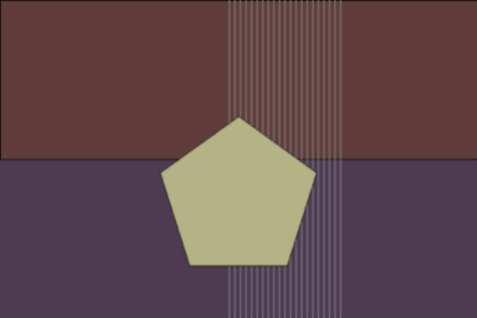
    


    
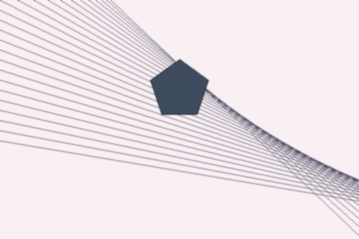
    


    
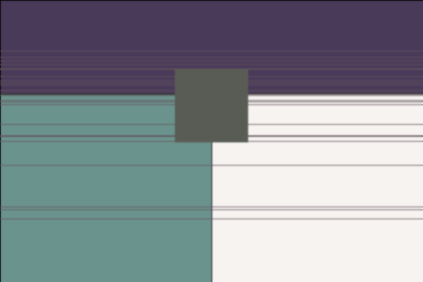
    


    
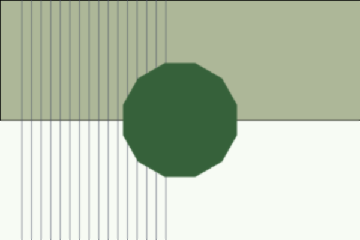
    


```python
from ArtGenerator import create_chaotic_art

# Generating five random artworks with "chaotic style"
for i in range(5):
    im = create_chaotic_art()
    display(im)
```


    
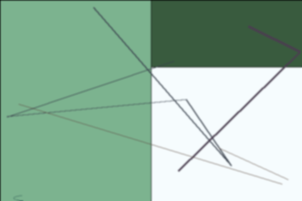
    


    
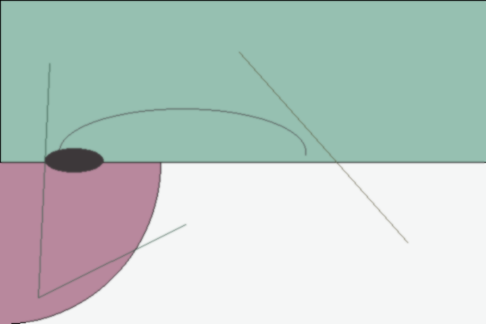
    


    
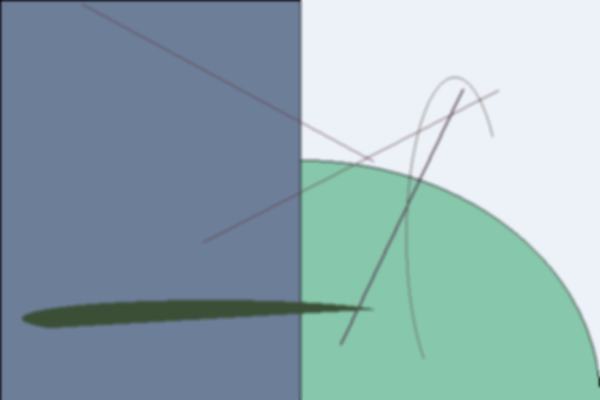
    


    
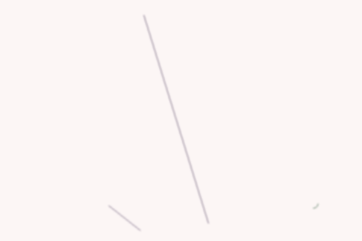
    


    
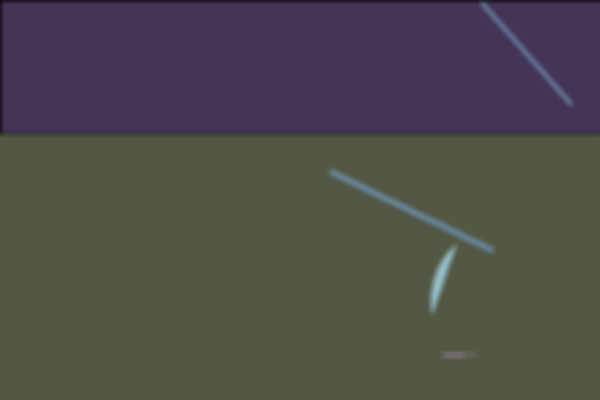
    


**To save the images you can either add the argument "save_path", to save the image to the desired path, or call the save method after generenting the image, ex:**

***im = create_chaotic_art()***

***im.save(save_path, format='jpeg')***

This way you can see the image before deciding if you want to save it or not


# Generating an Image with ArtGenerator Class

**Alternatively, you can directly use the class ArtGenerator to create artworks more personalized**

+ When an ArtGenerator object is a "base" image is generated and saved as the attribute self.img
+ The class has a series of methods that change the base image with elements of different types and random properties

**The docstrings of the code are very explanatory, so instead of exhaustively explaining what each method does, I'll show you a practical example of how to generate images this way, and invite you to enter help(ArtGenerator) and explore the methods**


```python
from ArtGenerator import ArtGenerator

# Create the object
img_test = ArtGenerator(bg_type='light')
```


```python
# Base image with random background color
img_test.img
```


    
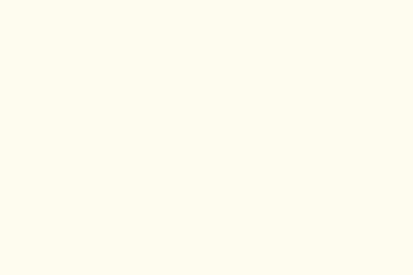
    


```python
# changing the background randomly
img_test.alter_background(repeat = 1, allow_circle = False)
img_test.img
```


    
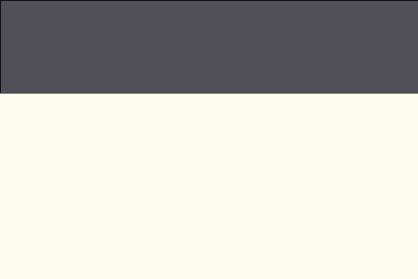
    


```python
# Adding curve effect
img_test.add_curve_effect(corner_choice = 'lower_left') # Try corner_choice = 'middle' for a spiral effect
img_test.img
```


    
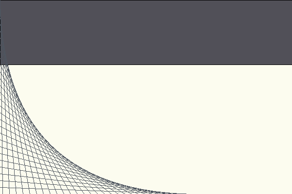
    


```python
# Adding random vertical lines twice 
img_test.draw_vertical_lines(repeat = 2)
img_test.img
```


    
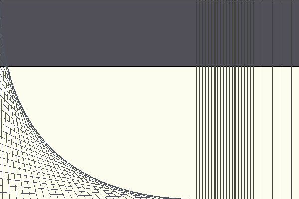
    


```python
# Adding another curve effect from the opposite corner
img_test.add_curve_effect(corner_choice = 'upper_right') 
img_test.img
```


    
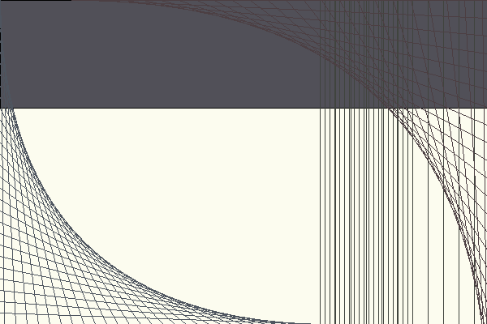
    


```python
# Adding a small triangle
img_test.draw_regular_polygon(n_sides = 3, radius = 80) 
img_test.img
```


    
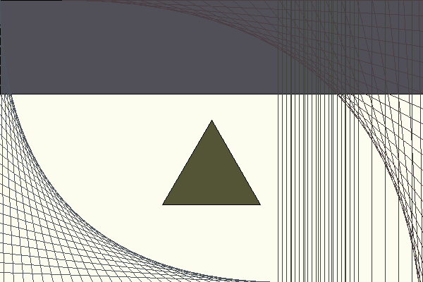
    


```python
# Saving 
img_test.save_img(path = 'images/teste_img.jpeg')
```

***Tip: it might be a good idea to make a copy of the object before modifying it, so it's possible to change the previous image without losing your "progress"***
